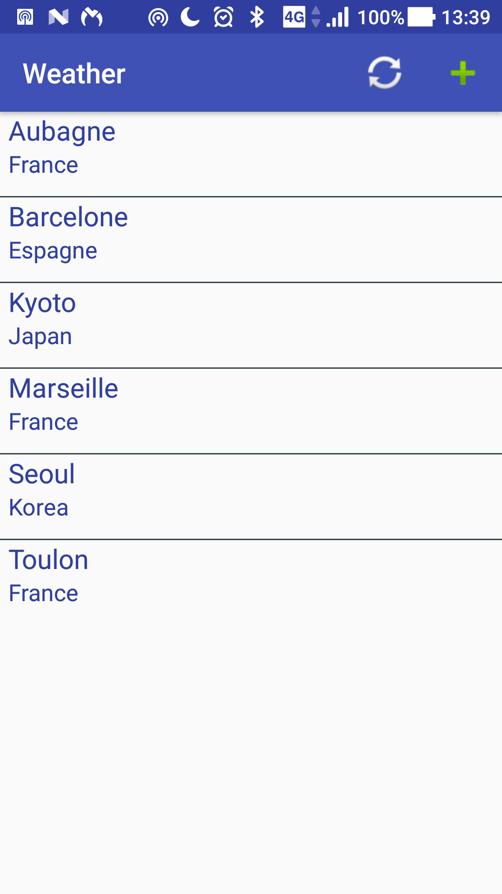
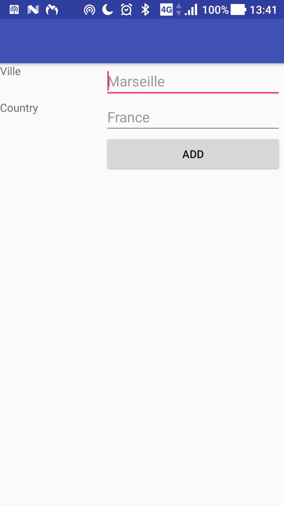
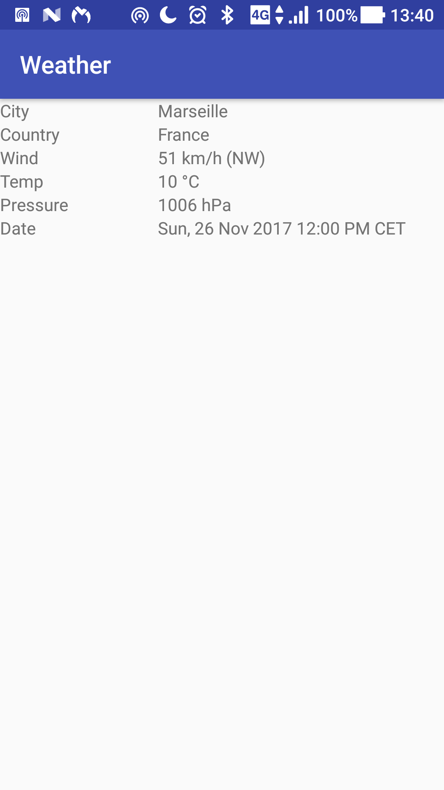
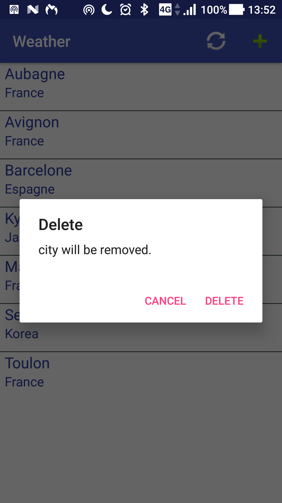

# Weather App

## Authors
Jonathan Corral
Student in master degree of computer science at CERI Avignon

## Contributors
Stephane Huet : [JSonResponseHandler](https://github.com/johnlejardinnier/weather_app/blob/master/app/src/main/java/com/quai13/weather/JSONResponseHandler.java)

## Instructions
- Clone repo on your workspace : `git clone https://github.com/johnlejardinnier/weather_app.git`

- Open the project with Android Studio

- Connect a smartphone to your computer

- Run the project

## Requirements
Require Android SDK
- Min SDK version: 23
- Target SDK version: 25

## About
Weather is a native Android application which allows you to get weather from Yahoo Api.

## Features
- Add city
- Remove city
- Update weather
- View basic weather information for a given city
- View cities ordered by name ASC

## Bugs
- Crash if city or country does not exist
- Layouts are not perfect
